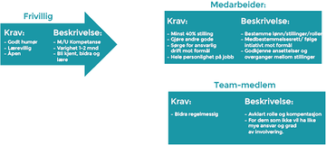

# Arbeidshåndbok for medarbeidere i Ducky
## Revisjon: Januar 2017

> «En veiledning i å vite hva du bør gjøre når ingen forteller deg hva du må gjøre.»

#### Innhold

[Forord](#forord)  
[DUCKYS Oppdrag: “Vi ser inn i fremtiden og vi ser en verden hvor alle bryr seg, og gjør det de kan for miljøet rundt seg.”](#duckys-oppdrag-vi-ser-inn-i-fremtiden-og-vi-ser-en-verden-hvor-alle-bryr-seg-og-gjør-det-de-kan-for-miljøet-rundt-seg)  
[DUCKYS Visjon:](#duckys-visjon)  
[DUCKYS Verdier:](#duckys-verdier)  
 [Kommunikasjonsmål:](#kommunikasjonsmål)  

[1. Om Ducky](#1-om-ducky)  
&nbsp;&nbsp;&nbsp;[1.1 Vårt formål](#11-vårt-formål)  
&nbsp;&nbsp;&nbsp;[1.2 Hva jobber vi for?](#12-hva-jobber-vi-for)  
&nbsp;&nbsp;&nbsp;[1.3 Hvordan skal Ducky som organisasjon gjøre dette?](#13-hvordan-skal-ducky-som-organisasjon-gjøre-dette)  
[2. Viktig for å jobbe i Ducky](#2-viktig-for-å-jobbe-i-ducky)  
&nbsp;&nbsp;&nbsp;[2.1 Prinsipp 1 - Vi ledes av formålet](#21-prinsipp-1-vi-ledes-av-formålet)  
&nbsp;&nbsp;&nbsp;[2.2 Prinsipp 2 - Hele mennesket på jobb](#22-prinsipp-2-hele-mennesket-på-jobb)  
&nbsp;&nbsp;&nbsp;[2.3 Prinsipp 3 - Medbestemmelse](#23-prinsipp-3-medbestemmelse)  
&nbsp;&nbsp;&nbsp;[2.4 Ansvar for medarbeidere?](#24-ansvar-for-medarbeidere)  
&nbsp;&nbsp;&nbsp;[2.5 Er det nødvendig med Coaching?](#25-er-det-nødvendig-med-coaching)  
&nbsp;&nbsp;&nbsp;[2.6 Type stillinger i Ducky](#26-type-stillinger-i-ducky)  
[3. Hvordan jobber man i Ducky?](#3-hvordan-jobber-man-i-ducky)  
&nbsp;&nbsp;&nbsp;[3.1. Medarbeiderne](#31-medarbeiderne)  
&nbsp;&nbsp;&nbsp;[3.2 Hva er en location:](#32-hva-er-en-location)  
&nbsp;&nbsp;&nbsp;[3.2.1 Team på tvers av fagdisipliner](#321-team-på-tvers-av-fagdisipliner)  
&nbsp;&nbsp;&nbsp;[3.3 Hvordan finner jeg ut hvilket prosjekt som trenger hjelp?](#33-hvordan-finner-jeg-ut-hvilket-prosjekt-som-trenger-hjelp)  
&nbsp;&nbsp;&nbsp;[3.4 Struktur og roller](#34-struktur-og-roller)  
&nbsp;&nbsp;&nbsp;[3.5 Hva skal man ikke gjøre](#35-hva-skal-man-ikke-gjøre)  
&nbsp;&nbsp;&nbsp;[3.6 Informasjonsflyt](#36-informasjonsflyt)  
&nbsp;&nbsp;&nbsp;[3.7 Hvordan skal Ducky vokse?](#37-hvordan-skal-ducky-vokse)  
&nbsp;&nbsp;&nbsp;[3.8 Hvordan starte nye locations?](#38-hvordan-starte-nye-locations)  
&nbsp;&nbsp;&nbsp;&nbsp;&nbsp;&nbsp;[3.8.1 Hver location burde ha:](#381-hver-location-burde-ha)  
&nbsp;&nbsp;&nbsp;&nbsp;&nbsp;&nbsp;[3.8.2 Regler for hver location](#382-regler-for-hver-location)  
&nbsp;&nbsp;&nbsp;[3.9 Hver location samt medarbeider burde evaluere og skrive ned hva som er viktig for dem.](#39-hver-location-samt-medarbeider-burde-evaluere-og-skrive-ned-hva-som-er-viktig-for-dem)  
[4. Hvordan skal Ducky få nye locations?](#4-hvordan-skal-ducky-få-nye-locations)  
&nbsp;&nbsp;&nbsp;[4.1 Integrering](#41-integrering)  
&nbsp;&nbsp;&nbsp;[4.2 Et system med prosedyrer](#42-et-system-med-prosedyrer)  
&nbsp;&nbsp;&nbsp;[4.3 kommunikasjon og bestemmelser mellom locations](#43-kommunikasjon-og-bestemmelser-mellom-locations)  
[5 Våre Locations](#5-våre-locations)  
&nbsp;&nbsp;&nbsp;[5.1 Ducky Challenges](#51-ducky-challenges)  
&nbsp;&nbsp;&nbsp;[5.2 Hvordan ser bra arbeid ut her:](#52-hvordan-ser-bra-arbeid-ut-her)  
&nbsp;&nbsp;&nbsp;[5.3 Hva bør vi gjøre for å skape bra ting her? (nær framtid)](#53-hva-bør-vi-gjøre-for-å-skape-bra-ting-her-nær-framtid)  
&nbsp;&nbsp;&nbsp;[5.4 Alle burde dele engasjerende og erfaring.](#54-alle-burde-dele-engasjerende-og-erfaring)  
&nbsp;&nbsp;&nbsp;[5.5 Ducky Calculator and Translator](#55-ducky-calculator-and-translator)  
&nbsp;&nbsp;&nbsp;[5.6 Thrust network](#56-thrust-network)  
[6. Opplæring/utvikling](#6-opplæringutvikling)  
&nbsp;&nbsp;&nbsp;[6.1 Personlig utvikling / Medarbeidersamtale](#61-personlig-utvikling-medarbeidersamtale)  
[7. Kjekt å vite](#7-kjekt-å-vite)  
&nbsp;&nbsp;&nbsp;[7.1 Arbeidstid](#71-arbeidstid)  
&nbsp;&nbsp;&nbsp;[7.2 Arbeidssted](#72-arbeidssted)  
&nbsp;&nbsp;&nbsp;[7.3 Stillingsprosent](#73-stillingsprosent)  
&nbsp;&nbsp;&nbsp;[7.4 Lønn og fordeler](#74-lønn-og-fordeler)  
&nbsp;&nbsp;&nbsp;[7.5 Utsatt utbetaling og risikotillegg](#75-utsatt-utbetaling-og-risikotillegg)  
&nbsp;&nbsp;&nbsp;[7.6 Ferie](#76-ferie)  
&nbsp;&nbsp;&nbsp;[7.7 Pensjon](#77-pensjon)  
&nbsp;&nbsp;&nbsp;[7.8 Forsikring](#78-forsikring)  
[8. Rekruttering](#8-rekruttering)  
&nbsp;&nbsp;&nbsp;[8.1 Konflikthåndtering](#81-konflikthåndtering)  
&nbsp;&nbsp;&nbsp;[8.2 Organisasjonsstruktur](#82-organisasjonsstruktur)  
&nbsp;&nbsp;&nbsp;[8.3 «Advisory Board»](#83-advisory-board)  
&nbsp;&nbsp;&nbsp;[8.4 vi må bygge et Trust Network istedet](#84-vi-må-bygge-et-trust-network-istedet)  
&nbsp;&nbsp;&nbsp;[8.5 Men husk](#85-men-husk)  
&nbsp;&nbsp;&nbsp;[8.6 Styret og generalforsamling](#86-styret-og-generalforsamling)  
[9. En ideel bedrift](#9-en-ideel-bedrift)  
&nbsp;&nbsp;&nbsp;[§ 6.0 Overskudd og utbytte](#60-overskudd-og-utbytte)  
&nbsp;&nbsp;&nbsp;[§ 7. Salg av aksjer](#7-salg-av-aksjer)  
&nbsp;&nbsp;&nbsp;[§ 8.0 Oppløsning av selskapet](#80-oppløsning-av-selskapet)  
[10. Om å utforske muligheter landskapet](#10-om-å-utforske-muligheter-landskapet)  
&nbsp;&nbsp;&nbsp;[10.1 Hva skjer her?](#101-hva-skjer-her)  
&nbsp;&nbsp;&nbsp;[10.2 Effektiv jobbing](#102-effektiv-jobbing)  

#### Forord
For å skape løsninger som påvirker verden positivt må vi først lage en arbeidsplass som fostrer godhet. Ducky skal
være en arbeidsplass der du kan bidra med hele ditt vesen og har det morsomt underveis. Målene til Ducky er
viktige, men det viktigste er idéene, kreativiteten og engasjementet til hver enkelt som jobber for å nå disse
målene.

Duckys medarbeiderfilosofi bygger på det grunnleggende prinsippet om at mennesker vil bidra om de har muligheten til det, og at vi alle har en lik verdi. Det viktigste hos Ducky er ikke å styrke eget ego og makt, men å bidra så godt vi kan til å gjøre våre kollegaer best mulig og dermed også styrke organisasjonen og samholdet. Ducky fungerer som et økosystem der enkeltindividet er åpent for nye impulser og muligheter, og dermed sikrer en dynamisk vekst for Ducky basert på valg som føles riktig. I et økosystem vil noen retninger mislykkes, mens andre vil spre seg raskt. I Ducky ansees det derfor som positivt å ta sats selv om det ofte kan føre til mislykkede forsøk.

#### DUCKYS Oppdrag: “Vi ser inn i fremtiden og vi ser en verden hvor alle bryr seg, og gjør det de kan for miljøet rundt seg.”
#### DUCKYS Visjon:
#### DUCKYS Verdier:
(Burde bli bestemt i fellesskap med alle medarbeiderne)
1. Personlig og samarbeidende effekt.
2. Happy people
3. Tillit
4. Selvstendighet
5. Kreativt og morro

– Hos Ducky er det en kultur for at man kan gjøre feil ofte, men feilene er små

> “We all cheat, steal and lie, but create a culture where you do this in a small way. ”

##### Kommunikasjonsmål:
Ducky ønsker å motivere folk til å leve bærekraftige liv. Med dette mener vi under sosiale, økonomiske og økologiske forhold. Det er viktig å huske at disse aspektene er linket sammen og de beste løsningene er promotert gjennom alle tre elementene for bærekraft. Ducky jobber hele tiden med å oppdage nye og gode løsninger som fører til en glad natur, glade mennesker og en økonomi som forsikrer de nødvendige ressursene i et langtidsperspektiv. Vi jobber for å fullføre vårt oppdrag ved å være en positiv og troverdig informasjonskanal, nasjonalt og internasjonalt og på alle arenaer hvor Ducky er representert.

#### 1. Om Ducky
##### 1.1 Vårt formål

Ducky ønsker å motivere flest mulig mennesker til å leve bærekraftig.

##### 1.2 Hva jobber vi for?

Når vi ønsker å motivere mennesker til bærekraft menes sosiale, økonomiske og økologiske forhold. Det er viktig å huske at disse aspektene henger tett sammen, og de beste løsningene fremmer alle tre elementer av bærekraft. Ducky jobber for å finne disse gode løsningene som fører til en glad natur, glade mennesker og en økonomi som sikrer nødvendige ressurser i et langt perspektiv.

Vi jobber for å oppfylle vårt formål gjennom å være en positiv og troverdig informasjonskanal lokalt, nasjonalt og internasjonalt og på alle arenaer der Ducky er til stede.

##### 1.3 Hvordan skal Ducky som organisasjon gjøre dette?
Ducky utforsker alternative måter å organisere daglig drift av selskapet på. Dette gjøres for å skape en drømmearbeidsplass med en organisasjonskultur som fremmer verdier vi ønsker å finne i et bærekraftig samfunn. En kultur hvor medarbeidere har mulighet til å reflektere over og påvirke sin arbeidsdag i tråd med et felles og bærekraftig formål.

Gjennom frihet, påvirkningskraft og tilgjengelige ressurser for medarbeidere vil Ducky kunne utvikle seg i mange retninger innenfor bedriftens formål. Det ligger derfor store muligheter for å påvirke privatpersoner, bedrifter, skoler, myndigheter, global handel og mye annet gjennom Ducky om det settes i gang initiativer for dette.

#### 2. Viktig for å jobbe i Ducky
##### 2.1 Prinsipp 1 - Vi ledes av formålet
Det finnes ingen offisielle ledere i Ducky, og vi står i utgangspunktet fritt til å ta avgjørelser så lenge det er i tråd med vårt formål. Lær mer om hvordan dette kan fungere
i praksis i kapittel 3.

##### 2.2 Prinsipp 2 - Hele mennesket på jobb
I Ducky ønsker vi å unngå at medarbeidere har på seg en maske på jobb for å skjule noe. For eksempel ved å late som om vi er kompetente i alle situasjoner, er usårbare, og gjør jobben perfekt hver gang kollegaer går forbi. I Ducky behøver vi aldri å gjøre ting som strider mot vår indre følelse av rett og galt, og vi deler gjerne gode og dårlige erfaringer/følelser med våre kollegaer.

Om du ønsker å utvikle seg som person, har du mulighet til å ta kurs, få coaching, selvreflekterende/meditasjon, eller andre måter å bli bedre kjent med deg selv dine kollegaer. Vi må selv føle på hva som er viktig i livet og i Ducky. Ved store og kostbare kurs bør du rådføre deg med kollegaer og argumentere for hvorfor dette er bra for organisasjonens mål.

##### 2.3 Prinsipp 3 - Medbestemmelse
Alle medarbeidere har like stor rett og plikt til å bestemme hvordan Ducky skal styres. Ved avgjørelser kreves ingen konsensus, men ved større beslutninger må kollegaer rådføres.

Viktige beslutninger i Ducky kan tas på en av to måter:

1. På bestemmelses møter som kan gjennomføres på følgende måte
a. En medarbeidere kommer med forslag til prosjekt, ting de ønsker å jobbe med, strategivalg, roller man ønsker å ha eller lignende.
b. Alle deltakere skal da ta en runde hvor man i fellesskap prøver å optimalisere forslaget.
c. En runde hvor man kan komme med innsigelser.
d. Om ingen kommer med gode motargumenter for hvorfor dette ikke er bra for Duckys formål kan forslaget gjennomføres.

2. Forhøre seg med eksperter og alle berørte medarbeidere.
Om man vil gjennomføre et forslag kan man høre med de som er eksperter på området, og alle medarbeidere som vil bli berørt av forslaget, og da søke råd om hvordan det best kan gjennomføres. Om dette ansees som et godt forslag av berørte medarbeidere kan forslaget gjennomføres.

Disse måtene å gjennomføre bestemmelser fører blant annet til:
  * Læring til mange.
  * At medarbeidere føler seg verdsatt og involvert.
  * Gode avgjørelser da avgjørelsene tas av de som er nære problemstillingen og må leve med konsekvensene.
  * Eierskap til avgjørelsen/beslutningen.
  * At man har det gøy i prosessen.
  * Mulighet for alle til å igangsette viktige prosesser, som for eksempel: Om noen kollegaer ser nye muligheter som stemmer overens med målet, eller vil opprette kontor et annet sted kan de starte dette etter å ha rådført seg med kollegaer. Slik oppnår man en dynamisk vekst og innovasjon som ikke krever organisering fra noen leder.

##### 2.4 Ansvar for medarbeidere?
De medarbeidere skal sikre at Ducky har finansiering for videre produktutvikling og forretningsutvikling. Alle medarbeiderne har delt ansvar for at Ducky sine økonomiske rammer. Dette skal gjøres i samsvar med de grunnleggende verdiene som Ducky er bygd på.

Alle ansatte har et ansvar for å fremme det sosiale på jobb, og bør søke og ta med hele sin personlighet til arbeidsplassen. Du har dermed et ansvar for å dele både gode og dårlige sider av deg selv og søke å forstå sine medarbeidere. Om man skal lykkes med dette bør man begynne med å forstå seg selv, utforske egne verdier og utforske hvorfor man reagerer som man gjør. Dette bør ofte gjøres gjennom dialog med medarbeidere.

##### 2.5 Er det nødvendig med Coaching?
Coaching er viktig, slik at man kan få god feedback, hver person kan på denne måten lære å bli den beste versjonen av seg selv for sin location, dette vil hjelpe til å løse konflikter i fremtiden.

> Individuell coaching er sannsynligvis det viktigste.

Vi kommer til å lære at hver problem/oppgave på arbeidsplassen handler om Ducky (oss). Derfor trenger vi å lære hvordan vi skal behandle hvert eneste problem/oppgave på en arbeidsplass. Vi kan ikke bruke makt for å hjelpe andre, fordi på den måten vil du virke kontrollerende.

> We all have issues, and we will always have coaching options available.

Også medarbeidersamtaler vil være en del av coaching så lenge samtalene betyr noe.

##### 2.6 Type stillinger i Ducky
Mange starter sitt engasjement i Ducky som frivillig. Dette for å utforske hvordan nye mennesker trives i en slik jobb og utforske hvordan de passer inn i teamet. For å bli Team-medlem eller medarbeider må dette godkjennes av samtlige medarbeidere på kontoret.  Team-medlem vil tilsvare en vanlig ansettelse i et «tradisjonelt» selskap, men du vil sannsynligvis oppleve større frihet enn i de fleste andre jobber da dine kollegaer som er medarbeidere vil være dine overordnede. Det vil også være mulighet for å bli medarbeider i Ducky som beskrevet i figur og tekst under.

#### 3. Hvordan jobber man i Ducky?
##### 3.1. Medarbeiderne
Ducky har en flat organisasjonsstruktur. Det er ingen ledere og du har ingen overordnede. Du kan sammen med dine medarbeidere stake ut kursen for Ducky og utforske hvordan man best kan fremme organisasjonens formål.

Du som medarbeider har et ansvar for å kontinuerlig finne ut hvor du kan gjøre mest nytte for deg selv.

##### 3.2 Hva er en location:
En location er forskjellige steder hvor Ducky kan jobbe. Hver location jobber med her sin kampanje/kunde basert på behov.

###### 3.2.1 Team på tvers av fagdisipliner
Dette skjer når en gruppe mennesker med forskjellig efaring jobber sammen mot et felles mål feks. når programmerere jobber tett sammen med designere etc.

##### 3.3 Hvordan finner jeg ut hvilket prosjekt som trenger hjelp?
Spør! Snakk med andre! Det er alltid mye som kan gjøres, og ved at dine medarbeidere vet hva du er dyktig på, hva du bryr deg om, og hva du interesserer deg for, finner du oftest et prosjekt som passer for deg.

For å finne ut hva en skal jobbe med kan det hjelpe å spørre seg selv:
Hvilket område eller prosjekt trenger mitt bidrag mest akkurat nå?
Hvilket prosjekt har størst nytteverdi for Ducky eller for kundene? Hvordan kan jeg bidra på dette prosjektet?
Burde Ducky gjøre noe som ikke blir gjort i dag?
Hva er interessant? Hva er givende? Hvor kan jeg best nyttiggjøre mine styrker?
Hvor kan jeg jobbe med noe jeg er interessert i og brenner for?

I tillegg har Ducky oppslagstavler på Trello og i Github som viser hvilke prosjekter som er pågående og hvilke oppgaver som må gjøres fremover. Denne er et godt virkemiddel for å finne arbeidsoppgaver.

##### 3.4 Struktur og roller
Struktur på kontoret og i prosjekter vil alltid oppstå uformelt. Noen vil kanskje bli «prosjektleder». Det betyr ikke at denne personen er sjef for prosjektet, men at denne personen kan inneha prosjektinformasjon og kundekontakt for å koordinere prosjektet.
Ducky har ingen faste jobbtitler som definerer hvilket ansvar og begrensninger en person har. I Ducky er det et dynamisk hierarki der rollen en person har kan forandre seg fra prosjekt til prosjekt eller fra dag til dag, alt etter hva som er mest hensiktsmessig.
Alle selskaper må ha ansatte som tar ansvar for enkelte prosjekter, for økonomi, for programmering, for salg, for design, for mat og annet som er viktig. Disse rollene kan man dele på og de fordeles i felleskap blant medarbeidere.

##### 3.5 Hva skal man ikke gjøre
Å gjøre feil eller mislykkes er helt OK. Det gir rom for læring og dermed finner vi ut hva vi skal gjøre eller ikke gjøre i fremtiden. Vi bør likevel unngå et par ting, som å begå den samme feilen gang på gang, eller å ikke høre på kollegaer eller kunder. Du bør alltid se på hvilke fakta som ligger foran deg, spesielt hvis du har tatt feil.

##### 3.6 Informasjonsflyt
All informasjon skal være tilgjengelig for alle ansatte da man ikke har noen leder med utvidede rettigheter.

##### 3.7 Hvordan skal Ducky vokse?
Ducky må i fremtiden ansette flere mennesker, og disse folkene vil vokse inn i flere locations innenfor Ducky.

> Ideelt sett er alle plassert sammen fysisk. men unntak kan bli gjort.

Hver location burde gå av seg selv med egne kunder/kampanjer i fremtiden, på denne måten klarer Ducky og jobbe med flere bedrifter på en gang.

Når noen locations får høyere inntekter/verdi de burde bruke tiden sin på å gi støtte til en annen startup location som trenger hjelp en periode.

Alle locations må forstå plassen sin og verdien av det, men ingen av de kan bruke sin posisjon slik at de andre mislykkes.

##### 3.8 Hvordan starte nye locations?
En ny location starter ideelt opp med 4 personer. En av disse burde være en prosjektleder som har ansvar for å informere og ha ukentlige møter med resten av Ducky- teamet.

###### 3.8.1 Hver location burde ha:
En programmerer, en grafisk designer, en på salg og en på support.
Noen locations burde være på over 16-24 mennesker, disse burde ha sin egen base hvor de kan dele ideer og møtes og dele diverse.

Det er svært viktig at hver location har den samme Ducky- ånden som Ducky har originalt. For at dette skal skje burde hver startup/location starte på samme måte som Ducky startet.

###### 3.8.2 Regler for hver location
Det er viktig at de forskjellige locations vet at selv om de er på forskjellige plasser så er de ikke er alene.
Å gjøre feil er lov, og det vil bli gitt en ny sjanse.

> “It's important to fail small often in order to grow and learn more.”

Men det er veldig viktig å reflektere over feilene og suksesshistoriene

##### 3.9 Hver location samt medarbeider burde evaluere og skrive ned hva som er viktig for dem.
Hva skjer her “main mission”
Hvordan ser bra arbeid ut her?
Hvordan følger man opp Ducky sine verdier?
– Code stay tidy
– Happy index
– Communication

Hver location i Ducky har sin egen strategiske partner. Og Ducky burde alltid være åpen for å forbedre design løsningen.

Hver location vil forbedre deres arbeid ved å dele erfaringer og tanker med andre locations.

> “What values are most suitable for good work here?”

to ganger i året vil team lederen kalle inn til en samtale som betyr noe. Samtalene burde kanskje bli tilrettelagt, eller man kan bare ta tid fra medarbeidernes hverdag for å prate med de.

#### 4. Hvordan skal Ducky få nye locations?
Nye locations må bli skapt tidlig. Dette gir eksisterende locations muligheter til å leke med nye muligheter og man vil se at gamle og nye ideer vil oppstå!

Team følelsen kommer til å komme innen location og mellom designerne i gruppen. Dette vil gjøre det enklere å bytte mellom location enn å endre teams om noen av de andre locations trenger hjelp.

Det kan være et karrieretrekk å flytte litt rundt imellom locations, OPO (open participatory organizations).

##### 4.1 Integrering
Den beste måten å integrere nye mennesker til Ducky er gjennom mentoring fra den opprinnelige location.

Altså designere som mentorer nye designere og programmerere som mentorer nye programmer osv. Både coaching og mentoring er noe som må skje over tid.

##### 4.2 Et system med prosedyrer
Det er viktig med et velfungerende og bra system med prosedyrer slik at det blir enkelt å kopiere Ducky-spiriten for andre nyere medlemmer også.

Det kan være smart å eksperimentere med coaching, feks slik at forskjellige locations kan arrangere fester for hverandre på denne måten vil alle bli godt kjent med hverandre. Og Ducky vil oppdage at de vil få vekst både personlig og innad i teamene.

##### 4.3 kommunikasjon og bestemmelser mellom locations
locations burde ønske å ha en vertikal kommunikasjonsfunksjon. Dette betyr at det blir en organisasjon som flyter opp og ned gjennom organisasjonens hierarki struktur. Fra en generell arbeidsstyrke til de som har middels med ansvar og helt opp til ledelsen, og tilbake igjen. Dette er det motsatte av horisontal kommunikasjon.

#### 5 Våre Locations
##### 5.1 Ducky Challenges
Hva skjer her?
Ducky arbeider med mulighetene for nasjonale utfordringer i Europa gjennom salg, markedsføring, media og gjennom Ducky's thrust network, her vil det komme mange nye muligheter for Ducky å vise seg frem i det store bildet.

Ducky jobber med tilpassede kampanjer basert på kundens behov. Feks i IKEA kampanjen har Ducky fullt fokus på husholdning, og de små tingene som folk kan gjøre hjemme som kan hjelpe klimaet.

Dette betyr at Ducky alltid har definerte behov for deres kunder. Dette er gjort gjennom å lage konsept, utvikle design og koder, kjøre challenges med support og en oppdatert plattform basert på hva brukerne burde lære av alle challenges.
Så Ducky burde ha et design for alle end-users for å finne deres behov, på denne måten møter Ducky challenges publikummet sitt når som helst.

##### 5.2 Hvordan ser bra arbeid ut her:
God kommunikasjon mellom både designer og programmerer er essensielt fordi dette vil føre til bra teams og kjempe gode ideer og muligheter.

##### 5.3 Hva bør vi gjøre for å skape bra ting her? (nær framtid)
Ducky vil identifisere nøkkel personer som vil akselerere vekst i sitt felt.
I Ducky setter vi sammen programmerere til et teamwork med designere, selv om det noen ganger kan føles enklere og mer effektivt å jobbe alene.

Vi vil ha mandagsmøter med updates på hva alle sitter å jobber med. Og gjennom daglige gåturer kommer vi nærmere hverandre som medarbeidere. Det er viktig for alle å forstå og integrere god arbeidsflyt som passer Ducky bra og gjør medarbeiderne glade.

På Ducky skal det alltid være lav terskel for mentoring og deling mellom hverandre, på denne måten vil den personlige- og bedriftens-vekst bli positiv.

##### 5.4 Alle burde dele engasjerende og erfaring.
Det er viktig å dele engasjerende erfaring feks fra brukertesting, support eller kundemøter siden dette vil gi alle en større innsikt på hvordan Ducky sine kunder er og tenker.

##### 5.5 Ducky Calculator and Translator
Hva skjer her?
Kalkulatoren gjør det mulig for Ducky å følge muligheter for å dele klimadata (Open APIs) på denne måten kan Ducky påvirke global klimapolitikk. Både Climate Calculator og Ducky Translate gjør det enklere for folk å forstå all dataen som blir presentert på ducky.no fordi det forenkler og kommunikserer klimadata på en ny måte som ikke har vært gjort før. Dette blir gjort gjennom design og program climate-data database.

##### 5.6 Thrust network
Ducky jobber kontinuerlig for å ekspandere sitt thrust network som vil inneholde researchers, ikke statlige, organisasjoner, politikere og andre selskap som er positive mot Ducky og deler Duckys tro på at noe må bli gjort med miljøet.

#### 6. Opplæring/utvikling
Hos Ducky vil du arbeide med flinke folk innen mange fagområder. Den beste måten å utvikle seg selv på er å høre etter og lære så mye som mulig på tvers av disipliner. Du står fritt til å skaffe den kunnskapen du trenger for å gjennomføre de prosjektene du jobber med.

###### 6.1 Personlig utvikling / Medarbeidersamtale
En gang i året skal du evaluere din egen helhetlige arbeidsinnsats sett opp i mot Duckys verdier og hvilket ansvar som ligger på deg som ansatt. Denne evalueringen skal gjøres til minimum tre kollegaer som jobber relativt tett opp mot deg. Disse kollegaene skal deretter kommentere din evaluering før man i fellesskap skal finne potensiale for videre arbeid/utvikling. Kombiner gjerne denne øvelsen med en bedre middag.
Du er selv ansvarlig for å arrangere dette med dine kollegaer.

#### 7. Kjekt å vite
##### 7.1 Arbeidstid
Hos Ducky er det viktig å ha en balanse i livet, også mellom jobb og fritid. Dette betyr at selv om det noen ganger trengs å jobbe litt ekstra, vil overtid eller overdrevent lange dager ikke være normalt hos Ducky. For å få til en stabil og effektiv arbeidsdag hjelper det å kommunisere hvilke ressurser en trenger på prosjektet og ha et realistisk syn på hvor lang tid det vil ta. Hos Ducky tar ting så lang tid som det tar. Det er mer nyttig å ha en fornuftig arbeid/fritid balanse og heller jobbe effektivt når en er på jobb enn å jobbe hele døgnet.
Hos Ducky er det også viktig å trives i arbeidet en gjør. Derfor skal en gjerne benytte arbeidstid til å for eksempel hente frukt og kaffe til seg selv og sine medarbeidere. En oppfordres til å benytte seg av fasiliteter som sofa, huskestativ, turområder og annet som er tilgjengelig og ikke være redd for dette. Den viktigste ressursen til Ducky er en engasjert og lykkelig ansatt.

Ducky anbefaler en 7 timers effektiv arbeidsdag inkl. lunch, der en gleder seg til å komme på jobb og gjøre en forskjell. Anbefalt arbeidstid er mellom 09-15, men det er mest fordi da treffer du alle dine kule kollegaer som også er der til samme tid. I tillegg til de 7 timene bør man bruke 1 time pr. arbeidsdag på selvrealisering, oppdatering av samfunnsdebatt, opplæring eller på å gjøre det hyggelig for dine kollegaer eller andre. I Ducky har vi ikke overtidsbetalt, fordi vi ønsker ikke at folk skal jobbe overdrevent lange dager, og fordi man uansett er med på å bestemme egen lønn etter behov.

##### 7.2 Arbeidssted
Du vil arbeide på det stedet som du mener egner seg best for å løse aktuelle oppgaver. Det er helt akseptert å utenfor kontoret som f.eks hjemme, på kafé eller ute hos kunde.

##### 7.3 Stillingsprosent
Det er i utgangspunktet ønskelig at medarbeidere jobber 100%. Man står likevel fritt til å redusere stillingsprosenten i perioder eller permanent. Dette avklares da med medarbeidere i forkant.

##### 7.4 Lønn og fordeler
Hos Ducky er vi like mye verdt og ingen har krav på mer lønn enn andre. Mange er likevel i forskjellige faser i livet og har forskjellig motivasjon for å jobbe i Ducky og behov når det kommer til økonomi.

I Ducky kan du snart sette din egen lønn innenfor gitte rammer. Du kan velge din lønn ut i fra noen lønnstrinn, der du må diskutere ditt valg med flere av dine kollegaer. Bakgrunnen for valg bør være dine økonomiske behov, Duckys økonomi og ditt bidrag til Ducky.

Mulige lønnstrinn:
Lønnstrinn 1: 350.000,-
Lønnstrinn 2: 425.000,-
Lønnstrinn 3: 475.000,-
Lønnstrinn 4: 525.000,-

##### 7.5 Utsatt utbetaling og risikotillegg
Da bedriften er i en oppstartsfase vil det være ønskelig at deler av denne lønnen utbetales senere når økonomiske rammer er mer gunstig for bedriften. Du kan sammen med dine kollegaer vurdere hvor mye av denne lønnen som utbetales umiddelbart og hvor mye som utbetales på et senere tidspunkt. Utestående lønn vil øke med en rente på 5 % pr. år.
Utestående lønn vil utbetales når det ansees som forsvarlig av medarbeidere og styre.

##### 7.6 Ferie
Du har i Ducky rett på 25 dager ferie. Du er i utgangspunktet fri til å velge tidspunkt, men lurt å avklare dette med medarbeidere.

##### 7.7 Pensjon
Om du jobber fast i Ducky vil du ha innskuddsbasert pensjon på fortiden 2% av lønnen av Storebrand. Dette er en minimumsordning og vil økes med en mer stabil økonomi.

##### 7.8 Forsikring
Om du jobber fast i Ducky vil du få yrkesskadeforsikring av Storebrand.

#### 8. Rekruttering
For at Ducky skal kunne fungere med en organisasjonsform som beskrevet i denne håndboken er det viktigste vi gjør å ansette de riktige personene. Derfor skal så mange medarbeidere som mulig konsulteres ved nyansettelser og alle i Ducky har rett til å være med på intervjuer og ha en stemme i ansettelsesprosessen. Viktige spørsmål en kan stille seg selv i en slik prosess er:

Har denne personen de rette verdiene og holdningen?
Kan denne personen oppriktig sette seg inn i Duckys formål?
Ville jeg hatt denne personen som sjef?
Ville denne personen kunne samarbeide bra med andre?
Kan denne personen bryte ned og løse problemer?
Har denne personen evne til selvinnsikt og selvkritikk?
Er denne personen åpen på hvem han/hun er (ingen maske)?
Vil denne personen passe inn i et miljø med stor grad av frihet?

Hvis svarene her er «Ja» er det et positivt tegn på at denne personen vil kunne gjøre en god innsats i Ducky. Et viktig aspekt når en ansetter nye medarbeidere er at en aldri bør «fire på kravene». For at Ducky skal fungere med ønsket organisasjonsform er det viktig at alle som arbeider i Ducky har evnen og viljen til å jobbe på denne måten.

Trenger en akutt hjelp i kortere tidsperioder er det bedre å benytte seg av midlertidige og prosjektbaserte ansettelser enn å ansette feil medarbeider.

##### 8.1 Konflikthåndtering
Ducky vil utforske metoder for konflikthåndtering på individnivå.
Om man har en følelse av at medarbeidere ikke handler i tråd med Duckys verdier og arbeidsavtalen  bør man ta dette opp med den det gjelder før dette blir et problem.

Stegvis kan det tenkes at dette gjøres på følgende måte:

Løse konflikten individuelt.
Spørre en megler i Ducky. (Vi benytter i dag en coach som kan fungere som megler)
Nedsette et panel med relevante medarbeidere.

Det er viktig at hele denne prosessen er konfidensiell. Dette for å hindre ryktespredning og misforståelser ut til utenforstående.

##### 8.2 Organisasjonsstruktur
Medbestemmelse slik det fungerer i Ducky fungerer sannsynligvis bra opptil en størrelse på ca 25 medarbeidere. Om vi blir flere enn dette vil vi sammen finne løsninger for hvordan grupper naturlig kan splittes opp i nærmest selvdriftende enheter. Dette kan organiseres på mange måter og må sikre at alle enheter deler på viktige støttefunksjoner som
kunnskapsdeling, markedsføringsmateriell og økonomi. Strategi for dette vil utarbeides i nær fremtid med alle medarbeidere.

En aktuell løsning er å basere Ducky rundt et teknologisenter med egen organisering med mindre enheter rundt som leverer tjenester til bedrifter, skoler, organisasjoner, etc.
For å sikre forsvarlig drift av selskapet i tråd med aksjeloven finnes det to støttefunksjoner for medarbeiderne i Ducky:

##### 8.3 «Advisory Board»
Vil bestå av 4-8 personer med spesialkompetanse som er nyttig for Selskapet. Advisory board har ingen juridisk makt, men kommer med fungerer som en mentortjeneste for Selskapet.

Normalt personer her er eksperter eller har erfaring fra lignende oppgaver. Men pass opp!

Dette kan bli en dårlig ide for Ducky fordi:
De kan tenke at de vet mye bedre enn oss.
Dette er mennesker som er vant med å ha makt, og de har derfor veldig mye innflytelse. Dette kan ødelegge for de andre medarbeiderne fra å få makt i Ducky.
Ofte kan de ha en funksjon som en “skygge”- regjering og på den måten prøve å forhandle/påvirke mer makt, dette kan bli veldig usunt.
Markedsføring med advisory board er bare effektivt hvis de virkelig bryr seg om folkene i selskapet. så da kan det være smartere å involvere folkene i Ducky's thrust network

- Men vi kan invitere forskjellige mennesker til å presentere, og ha folk som kan spørre spørsmål rundt vårt varemerke.

##### 8.4 vi må bygge et Trust Network istedet
Med et Trust Network kan vi dele vårt forhold med forskjellige bedrifter i forskjellige land.
Vårt Trust Network kan foreslå potensielle kunder for oss, og vi for dem tilbake.

##### 8.5 Men husk
Hvis vi løser et problem de trenger hjelp til, burde de betale oss.

- Vi trenger ikke haste inn i noe partnerskap. Føles det litt rart, er det sikkert det!

> “Keep thrust network as something personal, don't show that to anyone”

##### 8.6 Styret og generalforsamling
Styret og generalforsamling vil fungere som samme enhet og består i dag kun av gründerne. Styret har ingen praktisk funksjon i dag med unntak av at dette er lovpålagt i et aksjeselskap. Styret må derfor godkjenne årsregnskap etc.

Når selskapet får flere avdelinger eller at medarbeiderne ser det hensiktsmessig med et mer aktivt styre vil dette nedsettes etter valg blant medarbeidere.

Potensielle oppgaver for et styre i fremtiden vil kunne være:
  * Sette overordnede rammer for drift
  * Sikre en økonomisk forsvarlig drift. Foreslåtte rammer for budsjett, arbeidstid, antall ansatte, lønnsrammer og store strategiske beslutninger skal godkjennes av styret hvert år.
  * Ved interne konflikter som medarbeidere ikke greier å løse selv, eller ved brudd på denne avtalen kan styret bryte inn og i spesielle tilfeller gjennomføre tiltak slik som oppsigelser.
  * Kan initiere støttetiltak for å lette medarbeidernes daglige drift av oppgaver om ønskelig fra medarbeidere.

#### 9. En ideel bedrift
Ducky er registrert som et ideelt aksjeselskap. Det betyr at det har rettigheter som et aksjeselskap men vedtektene minner mest om en stiftelse. Viktige paragrafer fra vedtektene følger:

##### § 6.0 Overskudd og utbytte
Alt overskudd som genereres i Selskapet skal fremme videre utvikling og realisering av Selskapets målsetninger og vil forvaltes av Selskapet innenfor dets vedtatte formål. Da selskapet ikke har erverv som formål kan det ikke deles ut utbytte.

##### § 7. Salg av aksjer
Aksjer i Selskapet har begrenset omsettelighet og kan ikke pantsettes, omsettes eller på annen måte overdras til andre enn eksisterende aksjonærer i selskapet. Overdragelsessummen kan da ikke være høyere enn vedkommende aksjonærs inngangsverdi på aksjen(e) (kostpris). Dersom flere aksjonærer ønsker å overta aksjene fordeles disse forholdsmessig mellom de interesserte basert på deres forholdsmessige eierandel i selskapet.

##### § 8.0 Oppløsning av selskapet
I tilfelle oppløsning a selskapet, tilfaller selskapets midler formål som beskrevet i §3.0 eller beslektede formål.

#### 10. Om å utforske muligheter landskapet
##### 10.1 Hva skjer her?

> “Aktiviteter er strategi i natur”

Ducky vil også trenge et utvikler- thrust network på det strategisk nivå. Ducky må finne ut hvordan man skal flytte disse behovene til prosjekt. Ducky trenger også langtids tanker når det kommer til perspektiv/orientering i strategi.

Strategiske tiltak kommer til å oppstå hele tiden spesielt i de områdene hvor det blir praktisert vertikal integrasjon mellom locations.

##### 10.2 Effektiv jobbing
for å ha en mest mulig effektiv kommunikasjon mellom locations vil Ducky etter hvert trenge Newsletters, Slack, intranett og Open Source stuff osv.

Hvordan ser bra jobbing ut her?
  1. Research basert på innhold.
  2. Bidra til at klimadata blir integrert inn til kundenes liv ved å gjøre det en del av hverdagslivet deres.
  3. Teamwork
  4. Å gjøre det bedre enn resten av verden forventer.
  5. Enkel datastruktur gjør vanskelig data enklere å forstå og jobbe med.
  6. Prioriter arbeidsoppgaver basert på hva som haster mest. (ikke bare for kunder, men også for de gode ideene og på hva som gir mest mulig positiv energi).
